# Postgres-Avanzado
Proyecto PostgresSQL Avanzado


Autor : Guzman Reyes Marvin Noel

Descripcion :

# Linea de Tiempo

	1.- 1986: Inicio del proyecto POSTGRES.
    2.- 1996: Renombramiento a PostgreSQL 6.0.
    3.- 2005: Lanzamiento de PostgreSQL 8.0 (soporte nativo para Windows).
    4.- 2010: PostgreSQL 9.0 (replicación streaming, Hot Standby)
    5.- 2016: PostgreSQL 9.6 (mejoras en paralelización de consultas)
    6.- 2020: PostgreSQL 13 (optimización de índices, nuevas características de seguridad)


# Proyecto Comunicaciones Seguras

Base de datos para almacenar informacion de mensajeria entre una o mas personas , generacion de grupos para dispercion de mensajes , registro de usuarios y bitacora de registros .

# BACKUP  
![img] (./bdcomunicaciones28062024.sql)

# Script para Generacion de base de datos comunicaciones
```sql


BEGIN;


CREATE TABLE IF NOT EXISTS mensajeria."tblBitacora"
(
    "idBitacora" serial NOT NULL,
    fecha date NOT NULL,
    hora time with time zone NOT NULL,
    actividad text COLLATE pg_catalog."default" NOT NULL,
    CONSTRAINT "tblBitacora_pkey" PRIMARY KEY ("idBitacora")
);

CREATE TABLE IF NOT EXISTS mensajeria.tbl_usuarios
(
    idusuario serial NOT NULL,
    nombre character varying(50) COLLATE pg_catalog."default" NOT NULL,
    "apellidoPaterno" character varying(50) COLLATE pg_catalog."default" NOT NULL,
    "apellidoMaterno" character varying(50) COLLATE pg_catalog."default",
    expediente integer NOT NULL,
    "numTelefono" integer,
    email character varying(100) COLLATE pg_catalog."default" NOT NULL,
    CONSTRAINT tbl_usuarios_pkey PRIMARY KEY (idusuario)
);

CREATE TABLE IF NOT EXISTS mensajeria."tblaccesoUsuarios"
(
    idacceso serial NOT NULL,
    username character varying(50) COLLATE pg_catalog."default" NOT NULL,
    password character varying(250) COLLATE pg_catalog."default" NOT NULL,
    token character varying(250) COLLATE pg_catalog."default" NOT NULL,
    salt character varying(250) COLLATE pg_catalog."default" NOT NULL,
    idusuario integer NOT NULL,
    CONSTRAINT "tblaccesoUsuarios_pkey" PRIMARY KEY (idacceso),
    CONSTRAINT username UNIQUE (username)
        INCLUDE(username)
);

CREATE TABLE IF NOT EXISTS mensajeria.tblgruposmensajes
(
    idgrupo serial NOT NULL,
    nombre character varying(50) COLLATE pg_catalog."default",
    idusuario integer,
    imagenurl character varying(150) COLLATE pg_catalog."default" NOT NULL,
    CONSTRAINT tblgruposmensajes_pkey PRIMARY KEY (idgrupo)
);

CREATE TABLE IF NOT EXISTS mensajeria.tblgrupousuario
(
    idgrupousuarios serial NOT NULL,
    idusuario integer NOT NULL,
    idgrupo serial NOT NULL,
    CONSTRAINT tblgrupousuario_pkey PRIMARY KEY (idgrupousuarios)
);

CREATE TABLE IF NOT EXISTS mensajeria.tblmensajes
(
    idmensajes serial NOT NULL,
    mensaje text COLLATE pg_catalog."default" NOT NULL,
    idusuario_send integer NOT NULL,
    idusuario_recieved integer NOT NULL,
    token character varying(300) COLLATE pg_catalog."default" NOT NULL,
    CONSTRAINT tblmensajes_pkey PRIMARY KEY (idmensajes)
);

ALTER TABLE IF EXISTS mensajeria."tblaccesoUsuarios"
    ADD CONSTRAINT fkidusuario FOREIGN KEY (idusuario)
    REFERENCES mensajeria.tbl_usuarios (idusuario) MATCH SIMPLE
    ON UPDATE NO ACTION
    ON DELETE NO ACTION
    NOT VALID;


ALTER TABLE IF EXISTS mensajeria.tblgruposmensajes
    ADD CONSTRAINT fk_idusuario FOREIGN KEY (idusuario)
    REFERENCES mensajeria.tbl_usuarios (idusuario) MATCH SIMPLE
    ON UPDATE NO ACTION
    ON DELETE NO ACTION
    NOT VALID;


ALTER TABLE IF EXISTS mensajeria.tblgrupousuario
    ADD CONSTRAINT fkidgrupo FOREIGN KEY (idgrupo)
    REFERENCES mensajeria.tblgruposmensajes (idgrupo) MATCH SIMPLE
    ON UPDATE NO ACTION
    ON DELETE NO ACTION
    NOT VALID;


ALTER TABLE IF EXISTS mensajeria.tblgrupousuario
    ADD CONSTRAINT fkidusuario FOREIGN KEY (idusuario)
    REFERENCES mensajeria.tbl_usuarios (idusuario) MATCH SIMPLE
    ON UPDATE NO ACTION
    ON DELETE NO ACTION
    NOT VALID;


ALTER TABLE IF EXISTS mensajeria.tblmensajes
    ADD CONSTRAINT fkidusuariorecieved FOREIGN KEY (idusuario_recieved)
    REFERENCES mensajeria.tbl_usuarios (idusuario) MATCH SIMPLE
    ON UPDATE NO ACTION
    ON DELETE NO ACTION
    NOT VALID;


ALTER TABLE IF EXISTS mensajeria.tblmensajes
    ADD CONSTRAINT fkidusuariosend FOREIGN KEY (idusuario_send)
    REFERENCES mensajeria.tbl_usuarios (idusuario) MATCH SIMPLE
    ON UPDATE NO ACTION
    ON DELETE NO ACTION
    NOT VALID;

END;
```
# Consultas SQL


# Configuración del entorno SQL

Para la configuracion del entorno se realiza la instalacion de postgresql 15.6 y pgadmin como administrador de las bases de datos 
desde la siguiente liga https://www.enterprisedb.com/postgresql-tutorial-resources-training-1?uuid=d0ed4d28-191f-4273-b6a9-427ab0b4c448&campaignId=Product_Trial_PostgreSQL_15


# Diseño de la base de datos


# Gestión de usuarios
Para generar un perfil de usuario es necesario seleccionar la opcion de Login / Group roles

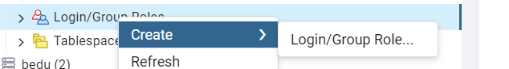

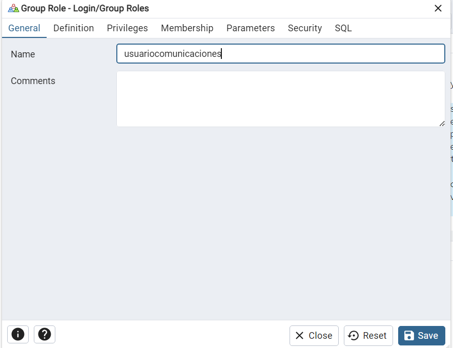

Asignamos una contraseña para este usuario 
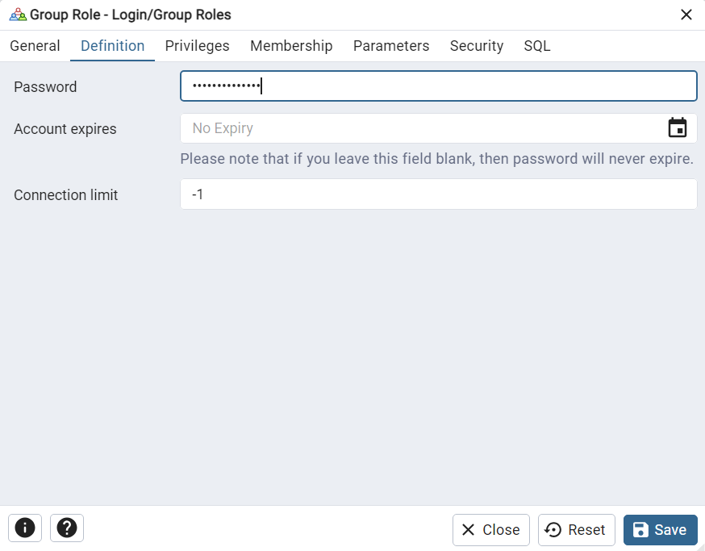

Le asignamos permisos de solo loguin 


Guardamos nuestro rol el cual debe aparecer dentro del listado de Login / Group roles
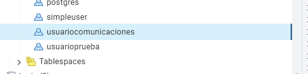


Permisos para consulta de una tabla 
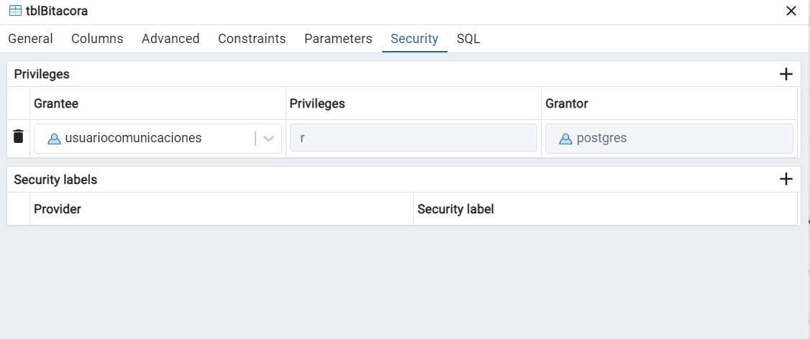

# Creando una copia de seguridad

Seleccionamos la base de datos que tenemos para realizar el respaldo y seleccionamos la opcion backup

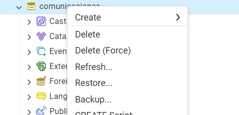

Asignamos un nombre y rol name
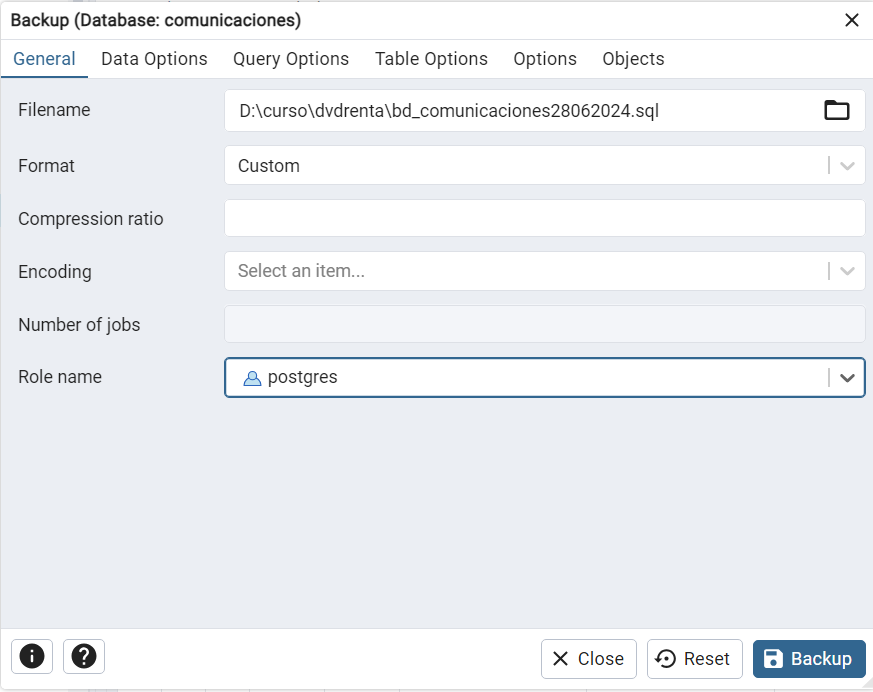
   
Seleccionamos las siguientes opciones de datos.
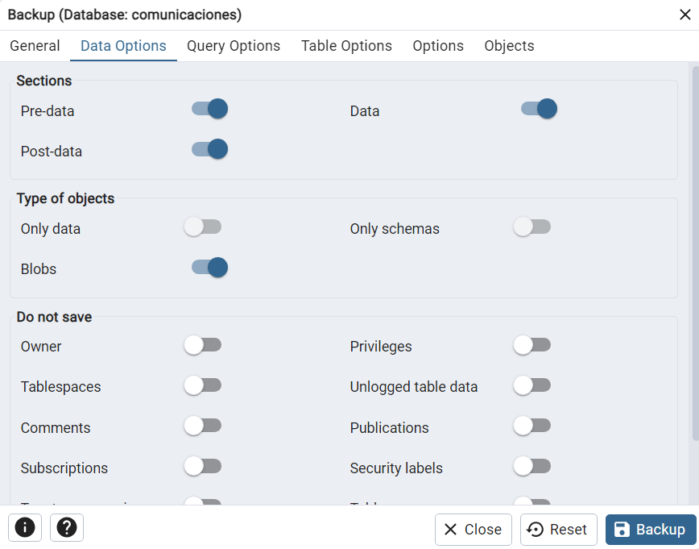
   
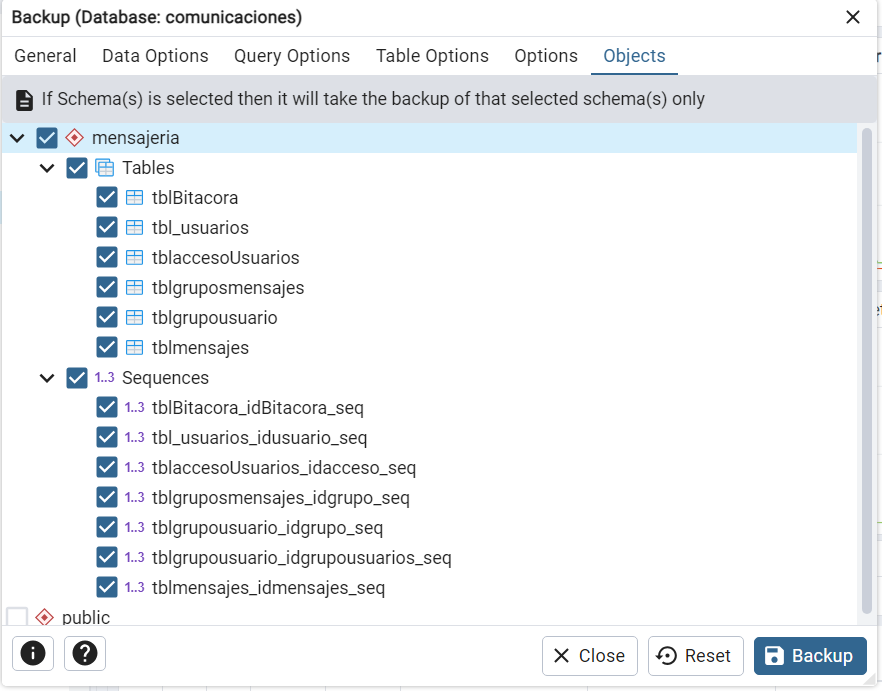

# Consultas
```sql
SELECT * FROM mensajeria.tbl_usuarios
ORDER BY idusuario ASC 

SELECT CONCAT (a.nombre,' ', a."apellidoPaterno",' ', a."apellidoMaterno")AS nombre,
COUNT(b.idusuario_send) AS numero_mensajes
FROM mensajeria.tbl_usuarios AS a
JOIN mensajeria.tblmensajes AS b ON a.idusuario = b.idusuario_send
GROUP BY a.nombre, a."apellidoPaterno", a."apellidoMaterno"
ORDER BY 2 DESC 
limit 10;

	

SELECT 
    CONCAT(a.nombre, ' ', a."apellidoPaterno", ' ', a."apellidoMaterno") AS remitente,
	b.mensaje ,
    (SELECT CONCAT(nombre, ' ', "apellidoPaterno", ' ', "apellidoMaterno")
     FROM mensajeria.tbl_usuarios
     WHERE idusuario = b.idusuario_recieved) AS destinatario
FROM mensajeria.tbl_usuarios AS a
JOIN mensajeria.tblmensajes AS b ON a.idusuario = b.idusuario_send
WHERE b.idusuario_send = '3';


SELECT gm.nombre, count(g.idusuario) AS numero_miebros
	FROM mensajeria.tblgrupousuario AS g
	JOIN mensajeria.tblgruposmensajes AS gm ON g.idgrupo = gm.idgrupo
	GROUP BY gm.nombre
	ORDER BY 2 DESC
	LIMIT 3;

SELECT CONCAT(nombre, ' ', "apellidoPaterno", ' ', "apellidoMaterno") AS usuario, expediente,email
	FROM  mensajeria.tbl_usuarios WHERE nombre='Cleon' and "apellidoPaterno"='Mealiffe';

```
# Optimizando consultas
```sql
	EXPLAIN SELECT *
	FROM  mensajeria.tbl_usuarios WHERE nombre='Cleon' and "apellidoPaterno"='Mealiffe'
```
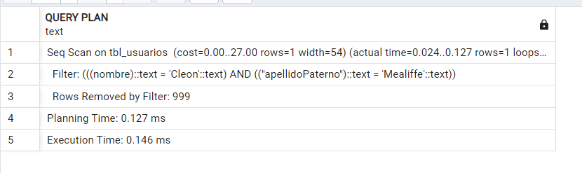


Creo el index de la tabla de usuarios por nombre y apellido paterno 

```sql
	CREATE INDEX idx_nombreapellidop ON mensajeria.tbl_usuarios(nombre, "apellidoPaterno");

```

Se realiza el analisis de la consulta despues de crear el indice

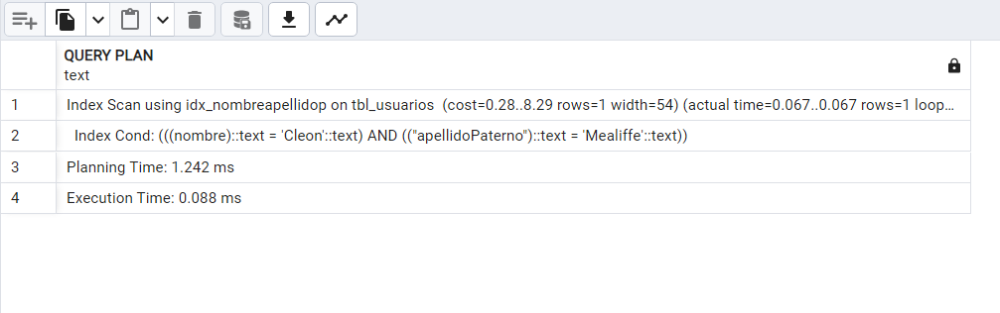


# Preparando un proceso de réplica y alta disponibilidad
Es necesario generar un proceso de replica de nuestras base de datos para grantizar la integridad y disponibilidad  de la informacion,
la cual se puden realizar meediante la generacion de respaldos automaticos en diferentes servidores.

Este proceso se puede realizar generando la configuracion  en el archivo de postgresql.conf 
```sql
	wal_level = replica
    max_wal_senders = 5
    wal_keep_size = 64MB

```
Dichos parametros se describen a continuación 

wal_level: Este parámetro determina cuánta información se escribe en el registro de transacciones (WAL, por sus siglas en inglés). El valor predeterminado es “replica”, lo que significa que se escribe suficiente información para admitir la replicación y el archivado del WAL. También permite ejecutar consultas de solo lectura en un servidor en espera. Si se establece en “minimal”, se eliminará todo el registro, excepto la información necesaria para recuperarse de un bloqueo o apagado inmediato.

max_wal_senders: Este parámetro especifica el número máximo de conexiones concurrentes desde servidores en espera o clientes de copia de seguridad de base de datos de transmisión (es decir, el número máximo de procesos de envío de WAL que se ejecutan simultáneamente). El valor predeterminado es 10, y si se establece en 0, la replicación está deshabilitada. Asegúrate de configurarlo en el servidor primario con el mismo valor o superior al del servidor primario para permitir consultas en el servidor en espera2.


wal_keep_size: Este parámetro especifica el tamaño mínimo de los segmentos de archivo de registro anteriores que se mantienen en el directorio pg_wal, en caso de que un servidor en espera necesite recuperarlos para la replicación en streaming. Si el valor de wal_keep_size es mayor que el valor de max_wal_size, y el servidor en espera está retrasado en la replicación, podría haber problemas. 

Por lo tanto, es importante ajustar estos valores según tus necesidades específicas


# Preparando el monitoreo
Monitoreo de la base de datos es de gran importancia para verificar la funcionalidad efectiva
1. Generar monitoreo de consultas
2. Mantenimiento a traves de Vacumm


# Migración de datos

Los datos se generaron en mokaro para realizacion de pruebas 
Es importante realizar un plan de migración para evitar inconsistencia de datos.

1. Fijar fechas para la migración.
2. Establecer la version de postgres a utilizar 
3. Realizar pruebas de funcionalidad
