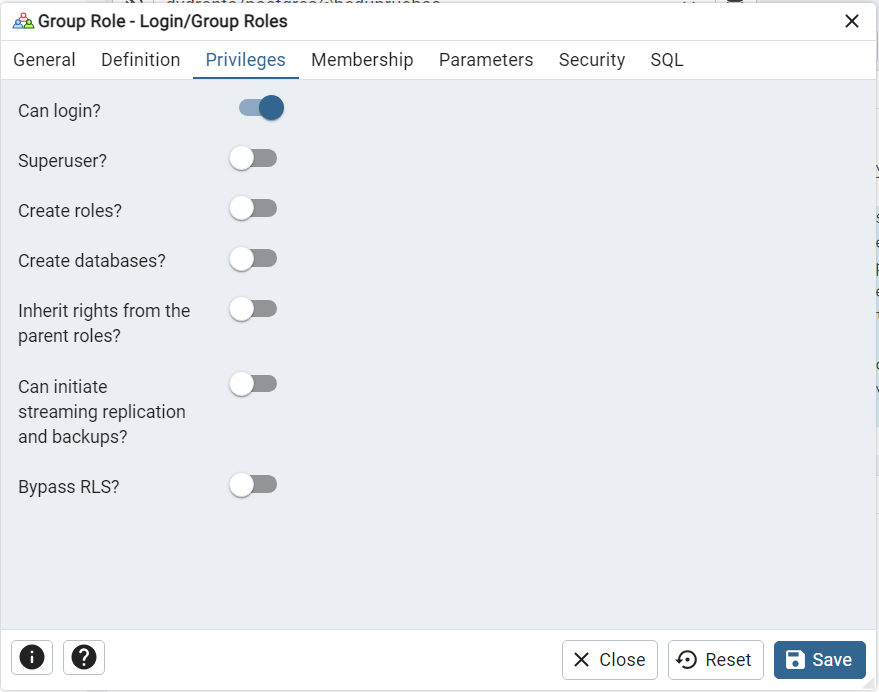

# Postgres-Avanzado
Proyecto PostgresSQL Avanzado


Autor : Guzman Reyes Marvin Noel

Descripcion :

# Linea de Tiempo

	1.- 1986: Inicio del proyecto POSTGRES.
    2.- 1996: Renombramiento a PostgreSQL 6.0.
    3.- 2005: Lanzamiento de PostgreSQL 8.0 (soporte nativo para Windows).
    4.- 2010: PostgreSQL 9.0 (replicación streaming, Hot Standby)
    5.- 2016: PostgreSQL 9.6 (mejoras en paralelización de consultas)
    6.- 2020: PostgreSQL 13 (optimización de índices, nuevas características de seguridad)


# Proyecto Comunicaciones Seguras

Base de datos para almacenar informacion de mensajeria entre una o mas personas , generacion de grupos para dispercion de mensajes , registro de usuarios y bitacora de registros .


# Script para Generacion de base de datos comunicaciones
```sql


BEGIN;


CREATE TABLE IF NOT EXISTS mensajeria."tblBitacora"
(
    "idBitacora" serial NOT NULL,
    fecha date NOT NULL,
    hora time with time zone NOT NULL,
    actividad text COLLATE pg_catalog."default" NOT NULL,
    CONSTRAINT "tblBitacora_pkey" PRIMARY KEY ("idBitacora")
);

CREATE TABLE IF NOT EXISTS mensajeria.tbl_usuarios
(
    idusuario serial NOT NULL,
    nombre character varying(50) COLLATE pg_catalog."default" NOT NULL,
    "apellidoPaterno" character varying(50) COLLATE pg_catalog."default" NOT NULL,
    "apellidoMaterno" character varying(50) COLLATE pg_catalog."default",
    expediente integer NOT NULL,
    "numTelefono" integer,
    email character varying(100) COLLATE pg_catalog."default" NOT NULL,
    CONSTRAINT tbl_usuarios_pkey PRIMARY KEY (idusuario)
);

CREATE TABLE IF NOT EXISTS mensajeria."tblaccesoUsuarios"
(
    idacceso serial NOT NULL,
    username character varying(50) COLLATE pg_catalog."default" NOT NULL,
    password character varying(250) COLLATE pg_catalog."default" NOT NULL,
    token character varying(250) COLLATE pg_catalog."default" NOT NULL,
    salt character varying(250) COLLATE pg_catalog."default" NOT NULL,
    idusuario integer NOT NULL,
    CONSTRAINT "tblaccesoUsuarios_pkey" PRIMARY KEY (idacceso),
    CONSTRAINT username UNIQUE (username)
        INCLUDE(username)
);

CREATE TABLE IF NOT EXISTS mensajeria.tblgruposmensajes
(
    idgrupo serial NOT NULL,
    nombre character varying(50) COLLATE pg_catalog."default",
    idusuario integer,
    imagenurl character varying(150) COLLATE pg_catalog."default" NOT NULL,
    CONSTRAINT tblgruposmensajes_pkey PRIMARY KEY (idgrupo)
);

CREATE TABLE IF NOT EXISTS mensajeria.tblgrupousuario
(
    idgrupousuarios serial NOT NULL,
    idusuario integer NOT NULL,
    idgrupo serial NOT NULL,
    CONSTRAINT tblgrupousuario_pkey PRIMARY KEY (idgrupousuarios)
);

CREATE TABLE IF NOT EXISTS mensajeria.tblmensajes
(
    idmensajes serial NOT NULL,
    mensaje text COLLATE pg_catalog."default" NOT NULL,
    idusuario_send integer NOT NULL,
    idusuario_recieved integer NOT NULL,
    token character varying(300) COLLATE pg_catalog."default" NOT NULL,
    CONSTRAINT tblmensajes_pkey PRIMARY KEY (idmensajes)
);

ALTER TABLE IF EXISTS mensajeria."tblaccesoUsuarios"
    ADD CONSTRAINT fkidusuario FOREIGN KEY (idusuario)
    REFERENCES mensajeria.tbl_usuarios (idusuario) MATCH SIMPLE
    ON UPDATE NO ACTION
    ON DELETE NO ACTION
    NOT VALID;


ALTER TABLE IF EXISTS mensajeria.tblgruposmensajes
    ADD CONSTRAINT fk_idusuario FOREIGN KEY (idusuario)
    REFERENCES mensajeria.tbl_usuarios (idusuario) MATCH SIMPLE
    ON UPDATE NO ACTION
    ON DELETE NO ACTION
    NOT VALID;


ALTER TABLE IF EXISTS mensajeria.tblgrupousuario
    ADD CONSTRAINT fkidgrupo FOREIGN KEY (idgrupo)
    REFERENCES mensajeria.tblgruposmensajes (idgrupo) MATCH SIMPLE
    ON UPDATE NO ACTION
    ON DELETE NO ACTION
    NOT VALID;


ALTER TABLE IF EXISTS mensajeria.tblgrupousuario
    ADD CONSTRAINT fkidusuario FOREIGN KEY (idusuario)
    REFERENCES mensajeria.tbl_usuarios (idusuario) MATCH SIMPLE
    ON UPDATE NO ACTION
    ON DELETE NO ACTION
    NOT VALID;


ALTER TABLE IF EXISTS mensajeria.tblmensajes
    ADD CONSTRAINT fkidusuariorecieved FOREIGN KEY (idusuario_recieved)
    REFERENCES mensajeria.tbl_usuarios (idusuario) MATCH SIMPLE
    ON UPDATE NO ACTION
    ON DELETE NO ACTION
    NOT VALID;


ALTER TABLE IF EXISTS mensajeria.tblmensajes
    ADD CONSTRAINT fkidusuariosend FOREIGN KEY (idusuario_send)
    REFERENCES mensajeria.tbl_usuarios (idusuario) MATCH SIMPLE
    ON UPDATE NO ACTION
    ON DELETE NO ACTION
    NOT VALID;

END;
```
# Consultas SQL


# Configuración del entorno SQL

Para la configuracion del entorno se realiza la instalacion de postgresql 15.6 y pgadmin como administrador de las bases de datos 
desde la siguiente liga https://www.enterprisedb.com/postgresql-tutorial-resources-training-1?uuid=d0ed4d28-191f-4273-b6a9-427ab0b4c448&campaignId=Product_Trial_PostgreSQL_15


# Diseño de la base de datos


# Gestión de usuarios
Para generar un perfil de usuario es necesario seleccionar la opcion de Login / Group roles


asignamos una contraseña para este usuario 


Le asignamos permisos de solo loguin 


guardamos nuestro rol el cual debe aparecer dentro del listado de Login / Group roles


Permisos para consulta de una tabla 


# Creando una copia de seguridad

Seleccionamos la base de datos que tenemos para realizar el respaldo

generamos a 

# Optimizando consultas

# Preparando un proceso de réplica y alta disponibilidad

# Preparando el monitoreo

# Migración de datos


